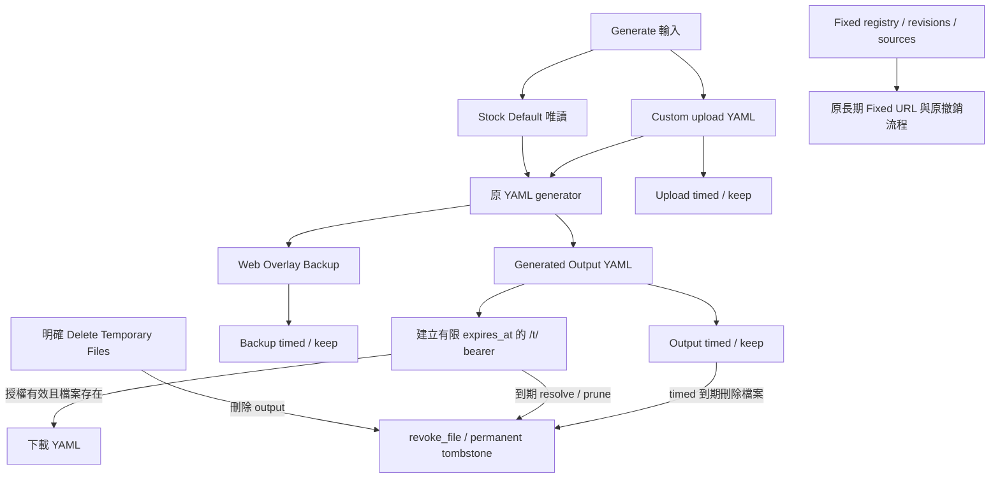

# 可選的資料保留策略

v1.8.0 Phase 3T-2 開發功能，尚未發布或部署；Latest Stable 仍為 v1.7.0。

## 舊預設與私人設定

三類伺服器資料互相獨立，policy 未設定時全部為 `timed`：

| 資料／固定目錄 | Policy | timed 預設 | 舊環境 fallback |
| --- | --- | --- | --- |
| 上傳 YAML／`uploads/` | `UPLOAD_RETENTION_POLICY` | `UPLOAD_RETENTION_HOURS=1` | hour 未設定時用 `FILE_RETENTION_DAYS` |
| 生成 YAML／`outputs/` | `OUTPUT_RETENTION_POLICY` | `OUTPUT_RETENTION_HOURS=24` | hour 未設定時用 `FILE_RETENTION_DAYS` |
| Web Overlay Backup／`backups/` | `BACKUP_RETENTION_POLICY` | `BACKUP_RETENTION_HOURS=168` | hour 未設定時用 `BACKUP_RETENTION_DAYS` |

`timed` 保留按 mtime 到期清理，`keep` 完全跳過對應目錄的 age-based deletion。
設定只接受精確的小寫 `timed` 或 `keep`；空字串、空白、未知值均在啟動初始化／
任何清理前拒絕，不回顯輸入。Hour／legacy days 的 0、負值、非有限值、無效數字
及乘法溢出仍 fallback 至原預設，**0 不表示永久**。合法舊 hour 小數仍保留。

操作者可在私人 `.env` 自行選擇，例如：

```dotenv
UPLOAD_RETENTION_POLICY=keep
OUTPUT_RETENTION_POLICY=keep
BACKUP_RETENTION_POLICY=keep
TEMP_LINK_LIFETIME_HOURS=24
```

設定依原環境載入／service restart 方式生效；Web 不編輯 `.env`。
本輪没有修改實際 `.env` 或 production。keep 不做一次性的資料清理或搬移，
不延長已發出的 token，不復活已刪除檔案；改回 timed 後，原清理流程可能刪除
已達期限的檔案。上傳大小 50MB、檔名／路徑檢查、生成引擎及安全寫入流程不變。

## 保存、下載與撤銷關係



Upload 是輸入材料；Overlay 是 generator 保存的輸入 YAML，並非完整 VPS 備份。
刪除 Upload／Overlay 不直接撤銷 Output，三種檔案 policy 互不影響。
`/t/` 必須同時通過未到期的 link 授權與 Output 存在檢查；保存檔案不等於延長授權。
既有合法手動刪除仍可刪 Upload／Output；Output 刪除會 revoke 對應 `/t/`。
沒有新增 Overlay 管理刪除按鈕、自動刪最舊資料或 protected backup 清理。

## 有限 Temporary Link

`TEMP_LINK_LIFETIME_HOURS` 是獨立的有限授權設定，只接受 1–87600 的 ASCII
正整數（最多五字元，即最多十年）；0、負值、小數、空白、NaN／Infinity 或超限
會在啟動前拒絕。不建立無限／None lifetime。

未設定時沿用**原 Output hours／legacy days 解析結果**，即使 Output policy 是 keep
也仍為相同有限值；預設 24 小時。設定只影響之後新建的 link，既有 expires_at
固定於建立時，不隨下載續期，也不追溯調整。Generate Result 標示
`Temporary link expires`，不把它宣稱為檔案保存到期日。

resolve 到期拒絕、prune、file revoke 及永久 tombstone 都保留，舊 ID 永不重新綁定。
到期 `/t/` 返回 404，即使 keep 的檔案仍在。TemporaryLinks 也拒絕非有限／無法
形成有效未來 expires_at 的輸入，未改 state schema。

歷史 `/download`、`/sub`、signed `/s/` 路由的既有簽章授權語義未改：它們仍取決於
有效既有 credential 與檔案存在，並沒有新增 `/t/` 的 TTL。選擇 keep 因而也會保留
這些歷史路由可讀取的檔案；操作者仍須保護既有 URL 並在需要時明確刪除檔案。
不新增／宣傳永久 temporary 分享功能；長期對外訂閱使用既有 Fixed Subscription。
Fixed registry、last-good source cache、revision lifecycle、Disable／Regenerate／Delete、
retired token 與長期 Fixed URL 不受本設定影響。

## 有界 Cleanup 與容量責任

keep 類型不打開、不掃描該目錄。timed 只掃描三個固定目錄的**直接子檔案**：
非隱藏、合法單一檔名、`.yaml`／`.yml`（大小寫相容）、普通檔案、單一 hardlink、
與目錄同 filesystem、目前 app UID 所有且非 group／other writable。
未知副檔名、目錄、symlink、FIFO、socket、device、不安全 owner／mode 或多 hardlink
均不刪除；無法開啟／核對身份則停止該次 sweep 並保留資料。

以 no-follow directory FD 進行 relative stat／open／unlink，核對 device、inode、mode、
UID/GID、link count、size、mtime／ctime 與當前目錄身份。沿用 app process-shared cleanup
lock／marker 節流。每目錄最多檢查 4096 entries、2 秒合作式 budget，深度固定一層，
不讀 YAML bytes；超限保留尚未掃描物件，下一個原 cleanup interval 才再嘗試。
大型目錄不承諾一次全部清完或公平遍歷；操作者須自行管理容量。
合作式 deadline 不能中斷卡住的 kernel IO；最後 identity check 與 unlink 不是對惡意
同 UID writer 的原子 compare-and-delete，不宣稱 filesystem snapshot 或 hostile-writer isolation。

不遞迴掃描 `state/`、logs、Fixed cache、`/root` updater／uninstall legacy backups、
offline Snapshot 或 Catalog，也不修改 Backup 工具 resource budgets／deployment guard。
新安全拒絕可能保留歷史不安全／非 YAML 物件，不會為了維持舊 broad deletion 而刪它們。

Settings → Runtime 唯讀顯示生效 policy；keep 顯示 `Keep — no age-based deletion;
manage disk capacity yourself.`，Output keep 另顯示有限 Temporary link lifetime。
提示只使用 enum 與已解析數值，不輸出原環境內容，不掃描全樹計算容量、讀檔或修改資料。
這是 policy／容量責任提示，不是剩餘空間保證。磁碟滿仍由原安全寫入失敗流程處理，
不截斷舊 YAML、不靜默覆寫、不刪備份來換取成功。

## Browser Draft

Generate 頁預設仍在 localStorage 保存 v1 草稿，TTL 為最後 saved_at 起 **30 天**。
勾選 `Keep draft until I clear it` 才啟用本機永久模式；policy preference 另存本機
`clash-yaml-manager.draft.policy.v1`，草稿仍為 v1，只有 keep record 加上
`retention_policy: keep`。舊 v1 record 沒有此欄位時仍按 30 天到期，不以 preference
追溯延長。切換前按 record 原 policy 檢查，不復活過期、刪除或損壞 record。
改回 timed 時對當前合法輸入重新保存有限 timestamp；未保存的空頁不因切換而建草稿。

保存項目使用 allowlist：batch node text、rows 的 country／name／link、source 選擇、
node update mode、special-group 選擇及 country／name overrides。不保存帳戶密碼、
CSRF token、Session Cookie、上傳檔案 bytes，也不把草稿送至伺服器。
節點 URL 本身可能包含節點密碼／憑證；同源程式或共享電腦使用者可能讀取它們，
頁面明確提示這個風險。永久模式只是不做 age expiry，瀏覽器清除／回收資料、
隱私模式、同源脚本及裝置故障仍會造成資料遺失。

Clear Draft 移除 record、清空輸入並取消 autosave；其他已開啟 tab 收到 record 刪除
通知也取消待執行 autosave，直到新編輯才重啟。待執行 save、pagehide、visibility
或 submit hook 不能自動重建。只有之後新的輸入編輯才重新啟用 autosave。
Clear 不重設已選擇的 policy preference。localStorage unavailable／full 時顯示固定
安全訊息，保持 DOM；清除失敗會提示使用 browser site-data 操作，不宣稱已刪成功。
Reload 後 Custom YAML 仍需重新選檔。其他使用者本機資料、server state 與 production 未操作。

## 驗收與限制

隔離真實檔案測試涵蓋 timed boundary、所有八種獨立 policy 組合、keep 長期保留、
fail-closed startup、legacy fallback、symlink／hardlink／FIFO／socket／目錄、identity race
拒絕、掃描上限、手動撤銷、Fixed lifecycle 與磁碟滿故障注入下原資料完整。
實際 Playwright 驗證預設／keep、Chromium process restart、Clear、不復活、隱私欄位、
quota／access-denied 與 mobile fit；所有資料與 profile 均為 disposable synthetic fixtures。

Session／CSRF 安全邊界與原測試保持；VERSION／Latest Stable 仍為 1.7.0／v1.7.0。
沒有 SSH tim、production deployment、真實備份／刪除或 restore。
永久保存不代表無限磁碟、完整 runtime 一致性、backup ready、restore proven 或永久可恢復。
